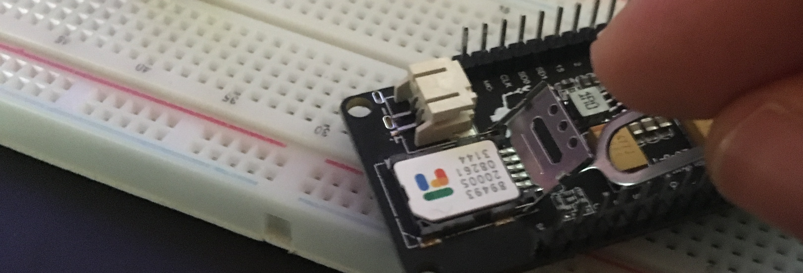
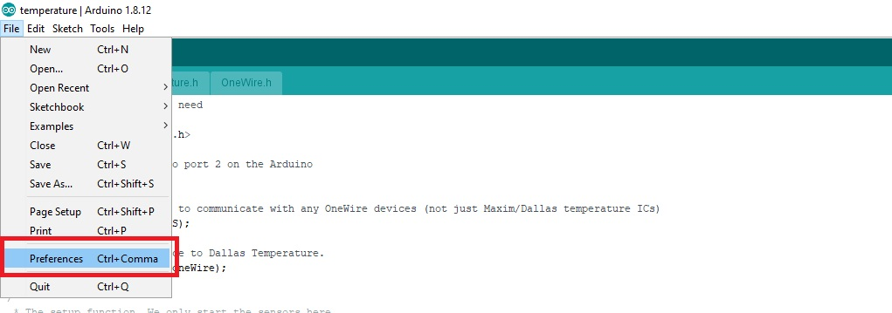
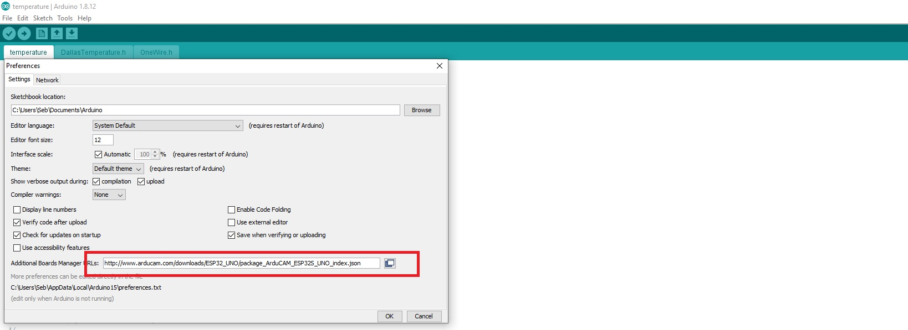
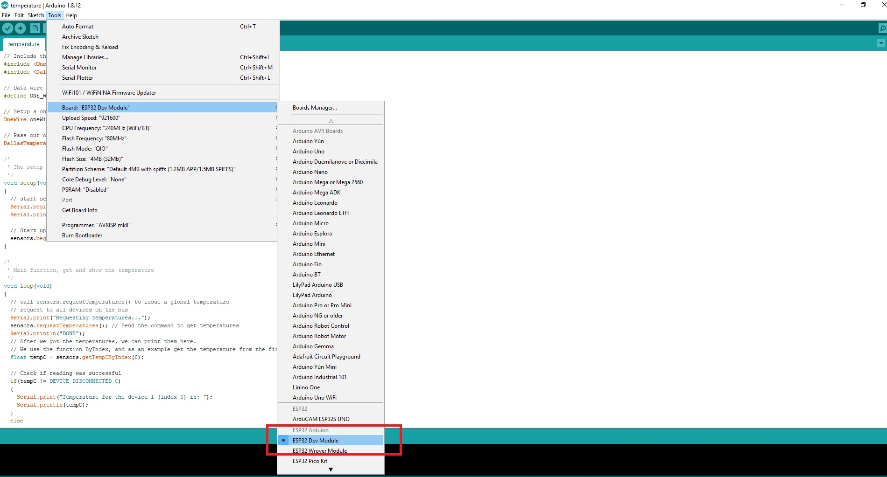
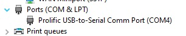
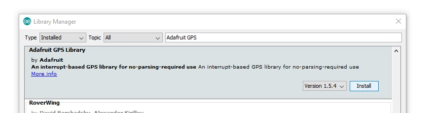

This was our workshop from 14 Feb, 2021

## Cellular (SMS + DATA) with GPS

If you are not familiar with working with an ESP32, please see this guide: 

Parts list:
- LILYGO TTGO T-Call V1.4 ESP32 (with SIM800L module)
    - Manufacturer Info: http://www.lilygo.cn/prod_view.aspx?TypeId=50033&Id=1127&FId=t3:50033:3
    - Amazon Purchase: https://www.amazon.com/gp/product/B07VL9Z1SJ
- Adafruit Ultimate GPS Breakout (ADA746)
    - Manufactuerer Info: https://learn.adafruit.com/adafruit-ultimate-gps
    - Amazon Purchase: https://www.amazon.com/gp/product/B01H1R8BK0

### Wiring/Setup

The wiring for this workshop is very straightfoward, it needs only 4 wires. For additional debugging, you can [wire up two LEDs to the serial connections](https://github.com/untrobotics/workshops/blob/main/esp32/cellular%2Bgps/diagrams/serial-leds.jpg)
 to ensure communication is working as expected. This is a good idea if you're unsure if your soldering or pin connections are sound.
 
The first step is to add your SIM card to the ESP32 Dev board, the slot is on the bottom of the board, and the holder tab must be slid forward before it can be raised up to insert the SIM card, like below:



Now all we need to do is connect the GPS module to the ESP32's 3.3V and GND pins, as well as the TX/RX pins, as shown in the diagram below:


And last, connect the USB to your computer!


### Software & Programming

The only software that we need is the Arduino IDE, which can be downloaded from here: https://www.arduino.cc/en/software/

Once the Arduino IDE is installed, we need to add the ESP32 board information. To do this, we just need to go to `File > Preferences` and then insert the following URLs as addition board manager URLs:

```https://dl.espressif.com/dl/package_esp32_index.json, http://arduino.esp8266.com/stable/package_esp8266com_index.json```

These steps are shown below:



The last step is to select the correct board and COM port, for the LILYGO ESP32 you should select `Tools > Board > ESP32 Dev Module`


If you have multiple COM ports listed and are unsure which to select, you will need to open the Windows Device Manager to look at the names



We're now ready to start programming!

### Code! :)
The code which is supported by the ESP32 and the Arduino IDE is a subset of C++, there are alternatives that you can use for programming ESP32s, such as Node.JS using [NodeMCU](https://www.nodemcu.com/), or Python using [MicroPython](https://micropython.org/).

We provide three example files which test each individual function:
- Send SMS: https://github.com/untrobotics/workshops/blob/main/esp32/cellular%2Bgps/modules/sms/SMS.ino
- Connect to the internet via GPRS (2G): https://github.com/untrobotics/workshops/blob/main/esp32/cellular%2Bgps/modules/gprs/GRPS.ino
- Receive GPS Info: https://github.com/untrobotics/workshops/blob/main/esp32/cellular%2Bgps/modules/gps/GPS.ino

Some of the files will require installing additional libraries, fortunately this is incredibly easy with the Arduino IDE. Simple go to `Tools > Manage Libraries` and then install:
- TinyGSM
- StreamDebugger
- Adafruit GPS Library



Furthermore, both manufactuerers provide plenty of sample code that you can use too! Adafruit's GPS module code is found [here](https://github.com/adafruit/Adafruit_GPS). and LILYGO's ESP32 and Cellular code is found [here](https://github.com/Xinyuan-LilyGO/LilyGo-T-Call-SIM800).

Once each of those functions are working as expected, you can combine them to report the GPS location of the ESP32 to a server every few seconds/minutes. This sample file can be found here: https://github.com/untrobotics/workshops/blob/main/esp32/cellular%2Bgps/modules/combined/ESP32_with_cellular_gps.ino

If you need help setting up a server to receive the GPS coordinates, please see our previous "Servers 'n' Stuff" workshop.
